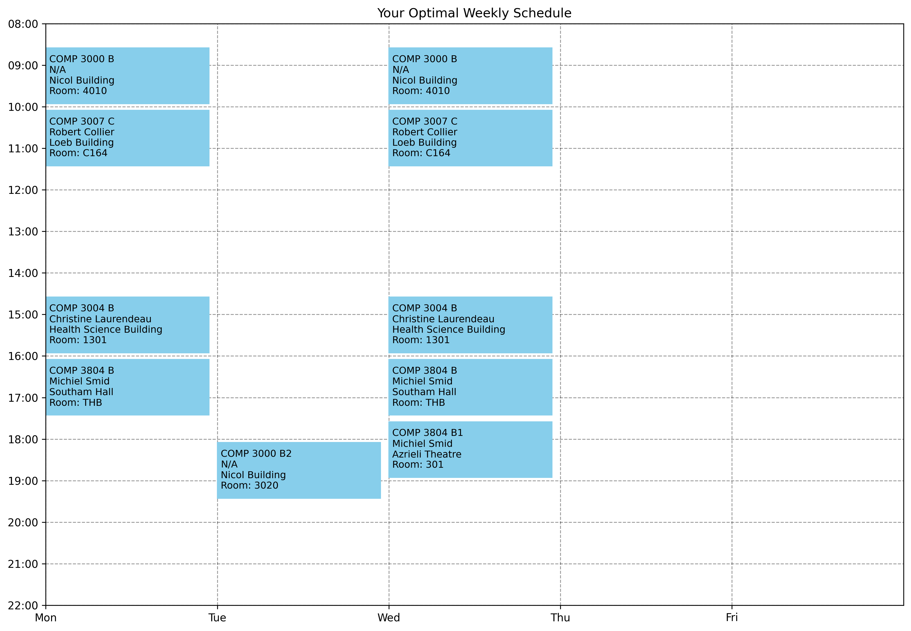

# CU Course Schedule Optimizer

Fetches course data from Carleton Central and generates optimal conflict-free schedules.

## Setup

```bash
pip install -r requirements.txt
```

## Usage

Edit `src/main.py`:

```python
COURSES = {"COMP 3000", "COMP 2406", "COMP 2108", "COMP 2109"}
EXCLUDE_PROFS = {""}
TERM = "202610"  # 10=winter, 20=summer, 30=fall
SHOW_LOCATION = True
DARK_MODE = False
```

Run:

```bash
python src/main.py
```

This will:
1. Fetch course data from Carleton Central (skips if already cached)
2. Store data in SQLite database (`courses.db`)
3. Generate top 3 optimal schedules as images in `schedules/`

## Scoring

Lower score = better schedule:
- 1000 points per campus day
- 1 point per minute of gaps between classes
- 20 point penalty for classes before 9am

## Example



Score 3450 = 3 days (3000) + 450 min gaps

## Options

| Option | Description |
|--------|-------------|
| `EXCLUDE_PROFS` | Set of professor names to avoid |
| `SHOW_LOCATION` | Show building on schedule plot |
| `DARK_MODE` | Dark theme for plots |
